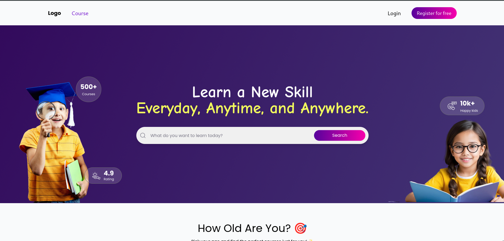

# LearnSphere 🚀
Welcome to LearnSphere, a vibrant and engaging online learning platform designed to spark curiosity and inspire young minds! 🌟 Tailored for kids, LearnSphere offers a fun, interactive, and personalized way to explore new skills and subjects, accessible anytime, anywhere.

## 🌟 Features

Interactive Hero Section: A visually captivating banner with a bold tagline: "Learn a New Skill Everyday, Anytime, and Anywhere."
Age-Based Course Filters: Kids can select their age range to discover courses tailored just for them, displayed with colorful borders.
Featured & New Courses: Showcases trending and newly launched courses kids love, presented in a sleek card carousel.
Top Teachers Showcase: Highlights expert instructors with engaging profiles, including their qualifications, experience, and subjects.
Upcoming Webinars: Alerts users to webinars starting within 24 hours, enhanced with vibrant visuals.
Category & Time Filters: Explore popular categories and filter courses by time to fit any schedule.
Responsive Design: Optimized for desktop and mobile, ensuring a seamless learning experience.

## 🛠️ Tech Stack


## <a href="https://learn-sphere-tau.vercel.app">🛠️ Deploy Link</a>
Frontend

React: JavaScript library for building dynamic user interfaces. <br>
Tailwind CSS: Utility-first CSS framework for responsive and modern styling.<br>
Custom Components: Reusable components like Header, Search, CardCarousel, Tabs, and TimeTabs.<br>
JavaScript: Powers dynamic functionality and interactivity.

## Data

Dummy Data: Sample teachers data (public/Data/dummyData.js) for teacher profiles and course displays.

## Assets

Custom Images: Backgrounds, teacher photos, and decorative elements in public/assets/.
<br>

```sh
📂 Project Structure
├── public/
│   ├── assets/                # Images for backgrounds, teacher profiles, etc.
│   └── Data/
│       └── dummyData.js       # Sample data for teachers
├── src/
│   ├── components/            # Reusable components (Header, Search, CardCarousel, Tabs, TimeTabs)
│   ├── App.js                 # Main application component
│   └── index.css              # Global styles (Tailwind CSS)
├── README.md                  # Project documentation
└── package.json               # Project dependencies and scripts
```




## 🚀 Getting Started
### Prerequisites

Node.js: v16 or higher
npm: v8 or higher

### Installation

#### Clone the Repository:
```sh
git clone https://github.com/yourusername/LearnSphere.git
cd LearnSphere
```

#### Install Dependencies:
```sh
npm install
```
Run the Application:
npm start


Open http://localhost:3000 in your browser to explore LearnSphere! 🎉


